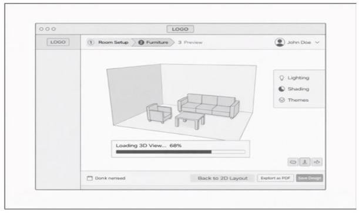

#  FurnishDesignStudio 🛋️

_HCI FURNITURE STORE APPLICATION_
_Bridging the gap between imagination and interior design. An HCI-driven, web-based furniture visualization system that empowers designers and customers to plan, customize, and experience spaces in real-time._

  
   
  <b>Figure 1:</b> 
<!-- 

  
   
  <b>Figure 2:</b>  -->

## 1. About 
**FurnishDesignStudio** is a specialized visualization tool designed for furniture retail environments. By integrating **Human-Computer Interaction (HCI)** principles, the application ensures high usability and efficiency for two primary user tiers:
* **Primary Users:** Professional Interior Designers requiring precision and portfolio management.
* **Secondary Stakeholders:** In-store customers who need a clear visual understanding of furniture placement.

The system allows users to define room specifications, interactively place items via drag-and-drop, and instantly visualize the result in a WebGL-powered 3D environment.

## 2. Tech Stack & Architecture:

* Core Engine: React + Vite (Fast development & optimized builds).
* 3-D Graphics: React Three Fiber (R3F) & Drei (Real-time WebGL rendering).
* Routing: React Router for seamless navigation (Login, Dashboard, Catalog, Workspace).
* State & Persistence: React Hooks (`useState`, `useEffect`) and LocalStorage API.
* HCI Logic: Implemented "Direct Manipulation" patterns for scaling, rotating, and placing objects.

## 3. Project Structure
Each directory represents a specific phase of the project lifecycle. Click the links below for detailed documentation

* **[/docs](./docs)** :  Analysis & Research ( _Detailed user-survey results, functional/non-functional requirements, HCI user personas, and technical specifications._)
* **[/design](./design)**: UI/UX & Assets (_Low-fidelity wireframes, high-fidelity._)
* **[/app](./app)** : Development Source (_Core React/Vite application including Login, Dashboard, Catalog, and 2D/3D Workspace components._)

## 4. Functional Requirements
* **Portfolio Management:** Secure designer login with Client Name search and full CRUD project capabilities.
* **Room Setup:** Hybrid input via manual entry or Shape Templates (L-shape/Square).
* **2D Layout Engine:** Top-down drag-and-drop grid with Auto-Scaling and interactive rotation handles.
* **3D Graphics:** One-click conversion to 3D space featuring Orbit, Pan, and Zoom walkthroughs.
* **Customization:** Selective color editing and Global Room Themes for rapid aesthetic changes.
* **Handover:** Generation of unique Viewer Links and PDF exports with precise layout dimensions.

## 5. Getting Started

1. **Clone the repository:** 
2. **Navigate to app:** `cd app` and `cd FurnishDesignStudio`
3. **Install:** `npm install`
4. **Launch:** `npm run dev`

## 6. License

  <b>HCI MODULE FURNITURE WEB APPLICATION</b> 
  <i>PUSL3122: HCI, Computer Graphics and Visualization</i> 
  <b>Group 50</b>

